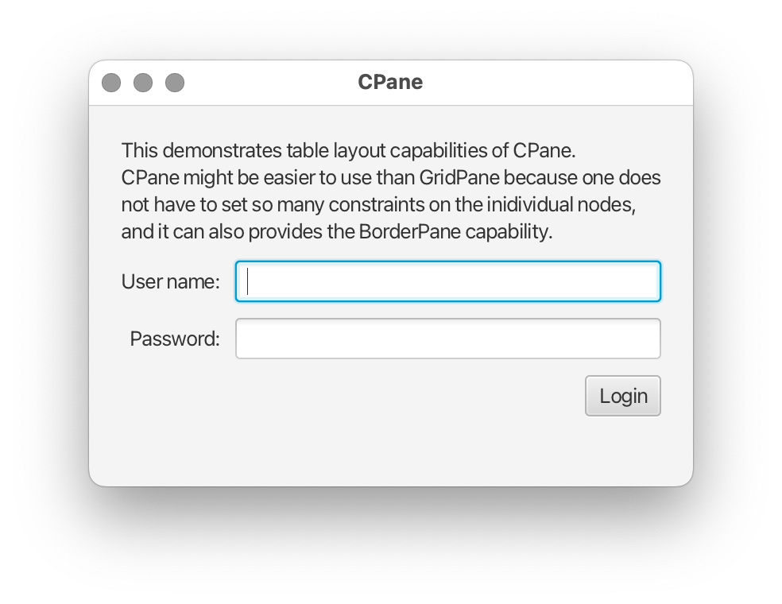

# CPane

CPane is a JavaFX `Pane` implementation that combines `BorderPane` and a table layout similar to `GridPane`.  
The grid (or, rather, table) layout is similar to my earlier Swing
[CPanel](https://github.com/andy-goryachev/PasswordSafe/blob/master/src/goryachev/swing/CPanel.java), 
which in turn was inspired by 
[info.clearthought.TableLayout](http://www.clearthought.info/)




## Example


```java
	@Override
	public void start(Stage stage) throws Exception
	{
		CPane cp = new CPane();
		cp.setGaps(10, 10);
		cp.setPadding(20);
		cp.addColumns
		(
			CPane.PREF,
			CPane.FILL,
			CPane.PREF
		);
		cp.addRows
		(
			CPane.PREF,
			CPane.PREF,
			CPane.PREF,
			CPane.PREF,
			CPane.FILL
		);
		int r = 0;
		cp.add(0, r, 3, 1, FX.label(FxCtl.WRAP_TEXT, "This demonstrates table layout capabilities of CPane.\nCPane might be easier to use than GridPane because one does not have to set so many constraints on the inidividual nodes, and it can also provides the BorderPane capability."));
		r++;
		cp.add(0, r, FX.label("User name:", Pos.CENTER_RIGHT));
		cp.add(1, r, 2, 1, new TextField());
		r++;
		cp.add(0, r, FX.label("Password:", Pos.CENTER_RIGHT));
		cp.add(1, r, 2, 1, new PasswordField());
		r++;
		cp.add(2, r, new Button("Login"));

		stage.setScene(new Scene(cp, 380, 240));
		stage.setTitle("CPane");
		stage.show();
	}
```


## License

This project and its source code is licensed under the [MIT License](../LICENSE).
